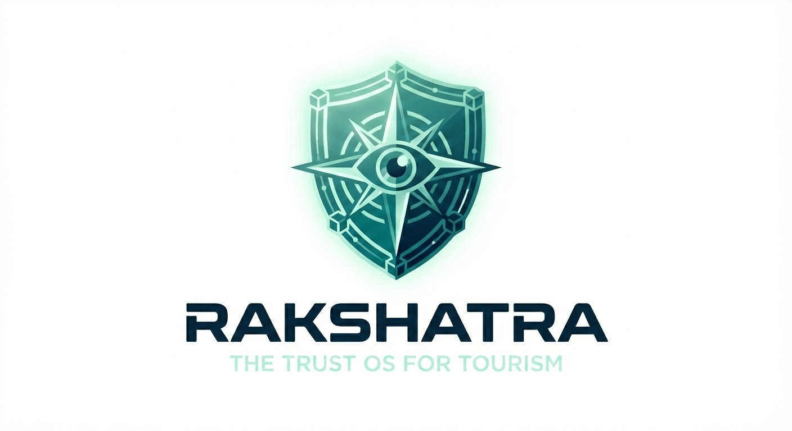
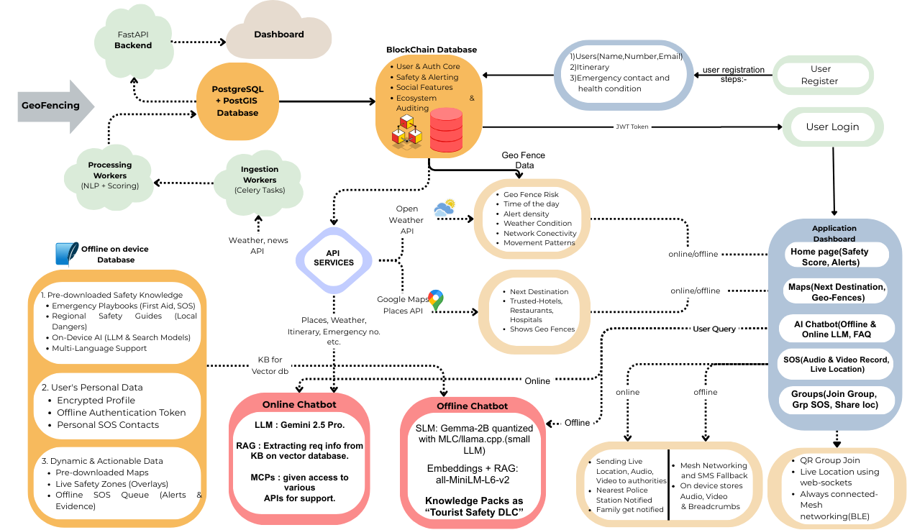

<div align="center">

  
  
  # RAKSHATRA
  **The Trust OS for Global Adventure Tourism**
  
  <p>
    
    
    
    
    
  </p>
  
  <h3> Monetizing Safety through Blockchain, AI & Offline Mesh Connectivity.</h3>

  <p align="center">
    <a href="#-the-problem">The Problem</a> •
    <a href="#-the-solution">The Solution</a> •
    <a href="#-tech-stack">Tech Stack</a> •
    <a href="#-architecture">Architecture</a> •
    <a href="#-business-viability">Business Model</a> •
    <a href="#-installation">Installation</a>
  </p>
</div>

---

## 🚨 The Problem: The Trust & Connectivity Paradox

Tourism in high-growth markets (like India, SE Asia) is broken by two critical failures:

1.  **The Connectivity Gap:** 60% of adventure tourism occurs in "shadow zones" (no network), rendering standard safety apps (Life360, Google Maps) useless during emergencies.
2.  **The Trust Deficit:** 40% of tourists cite "safety concerns" as a barrier to travel. Fake reviews and unverified service providers (hotels/taxis) create a dangerous ecosystem.

**Rakshatra** solves this by building a decentralized safety infrastructure that combines hardware-level connectivity with software-level intelligence.

---

## 🛡️ The Solution: A 3-Layer Safety Shield

Rakshatra is not just an app; it is a **Safety Ecosystem** operating on three distinct layers:

### 1. 📡 Layer 1: Offline Connectivity (Mesh & Edge AI)
* **Blockchain-Secured Mesh Network:** Proprietary peer-to-peer technology allows SOS signals to "hop" between devices via Bluetooth/Wi-Fi Direct to reach help without internet.
* **On-Device AI (Gemma-2B):** A quantized Small Language Model (SLM) running locally on the phone provides immediate first aid, navigation, and survival guides even in dead zones.

### 2. 🧠 Layer 2: Proactive Intelligence (Safety Score)
We don't just react to danger; we predict it using real-time data fusion:
* **Geofence Score:** Dynamic risk assessment based on real-time news, crowd density, and crime reports.
* **Health Score:** Fuses user health data with real-time **Weather & AQI**. (e.g., Warning an asthmatic trekker before they enter a low-oxygen, high-dust zone).

### 3. ⛓️ Layer 3: Immutable Trust (Blockchain)
* **Digital Tourist ID:** Verifies hotels, drivers, and guides on-chain.
* **Tamper-Proof Evidence:** If an SOS is triggered, audio/video snippets are hashed and stored on IPFS + Blockchain, ensuring evidence cannot be deleted or altered by corrupt actors.

---

## 💻 Tech Stack

| Domain | Technologies Used |
| :--- | :--- |
| **Frontend (Mobile)** | Flutter (Dart), Google Maps SDK |
| **Frontend (Web)** | React JS, Tailwind CSS |
| **Backend** | Node.js, Python (FastAPI), WebSockets |
| **AI & ML** | **Online:** Gemini 2.5 Pro (LangGraph)<br>**Offline:** Gemma-2B (Quantized/Edge), Vector DB |
| **Blockchain** | Solidity (Smart Contracts), Ganache/Truffle, IPFS |
| **Database** | PostgreSQL + PostGIS (Spatial), MySQL, SQLite (Local) |
| **APIs & Services** | UIDAI (KYC), OpenWeather, Twilio (SMS Fallback), FCM |

---

## 🏗️ Architecture & Workflow

The system follows a hybrid **Online-Offline** architecture:

1.  **Ingestion Layer:** Celery workers ingest real-time data (Weather, News, Crowd).
2.  **Processing Layer:** NLP + Scoring engines calculate dynamic **Safety Scores**.
3.  **Edge Layer:** Mobile devices sync "Safety DLCs" (Maps, Guides) for offline use.
4.  **Trust Layer:** Critical actions (SOS, Check-ins) are signed and committed to the Blockchain.

<div align="center">
  
  <br>
  <em>Figure 1: High-Level System Architecture</em>
</div>

---

## 💰 Business Viability

Rakshatra operates on a **"Safety as a Service"** model with three revenue streams:

| Stream | Target | Description | Pricing Model |
| :--- | :--- | :--- | :--- |
| **B2G** | **Government** | "Command Center" Dashboards for State Tourism Boards to monitor heatmaps & risks. | **₹50L - ₹1Cr / Year** (Licensing) |
| **B2B** | **Hotels/Taxis** | "Verified Safe" Blockchain Badge to increase tourist trust & bookings. | **₹2,500 / Year** (Subscription) |
| **B2C** | **Tourists** | **Freemium:** SOS is free.<br>**Premium:** Offline Maps, AI Itinerary, Insurance. | **₹499 / Month** (Adventure Pass) |

---

## 🚀 Key Features Breakdown

- [x] **Smart SOS:** Auto-trigger panic button with anomaly detection (breadcrumbs).
- [x] **Offline Chatbot:** Medical & Navigation assistance without internet.
- [x] **Secure Digital ID:** KYC-verified profiles for tourists and service providers.
- [x] **Live Heatmaps:** Real-time visualization of safe vs. unsafe zones.
- [x] **Evidence Locker:** Blockchain-backed storage for incident reporting.

---

## 🛠️ Installation & Setup

### Prerequisites
* Flutter SDK
* Node.js & Python 3.9+
* Ganache (for local Blockchain testing)

### 1. Clone the Repo
```bash
git clone [https://github.com/jadhavswapnil01/Rakshatra-Ai-Final-Boss.git](https://github.com/yourusername/rakshatra.git)
cd rakshatra

2. Backend SetupBashcd backend
pip install -r requirements.txt
uvicorn main:app --reload
3. Mobile App SetupBashcd mobile_app
flutter pub get
flutter run
🔮 Future RoadmapPhase 1: Pilot launch in Himachal Pradesh / Northeast India (B2G Focus).Phase 2: Integration with IoT Wearables (Smartwatches) for bio-metric SOS.Phase 3: Global expansion to SE Asia & integration with Embassy databases.👥 Contributors<div align="center"><h3>Team: AI FINAL BOSS</h3>Swapnil JadhavAvishkar Suryawanshi👨‍💻 Full Stack / AI Lead🔗 Blockchain / Backend Lead<a href="https://www.google.com/search?q=https://github.com/SwapnilJadhavProfile">GitHub</a><a href="https://www.google.com/search?q=https://github.com/AvishkarProfile">GitHub</a></div><div align="center"><sub>Built for AI BOOMI Transforming Tourism with Trust.</sub></div>